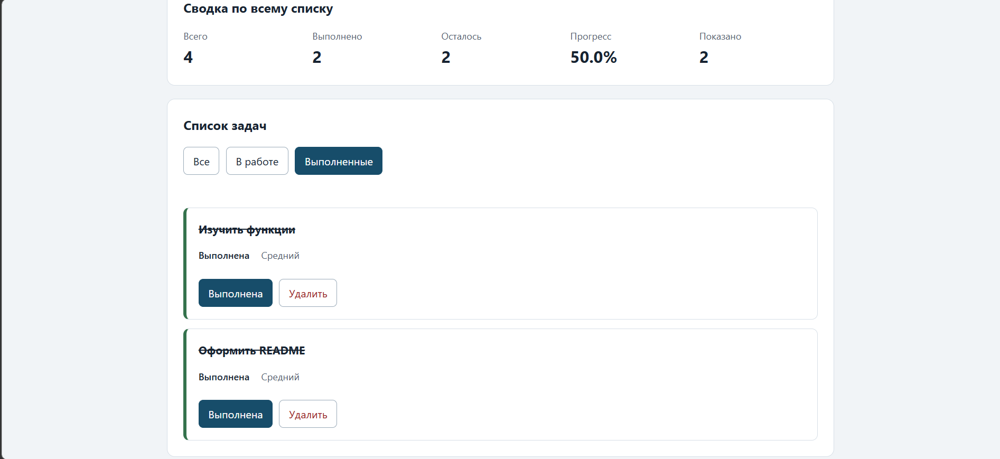
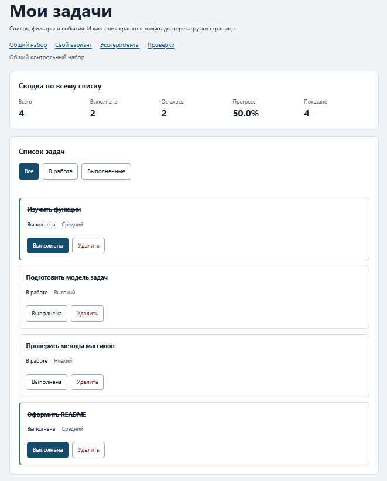
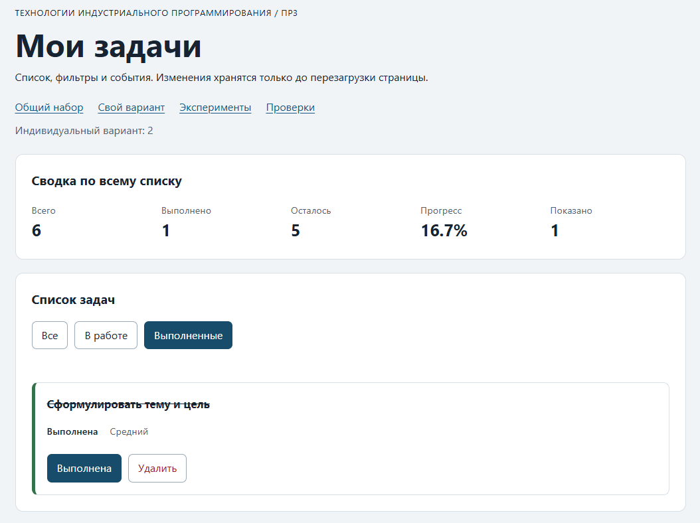
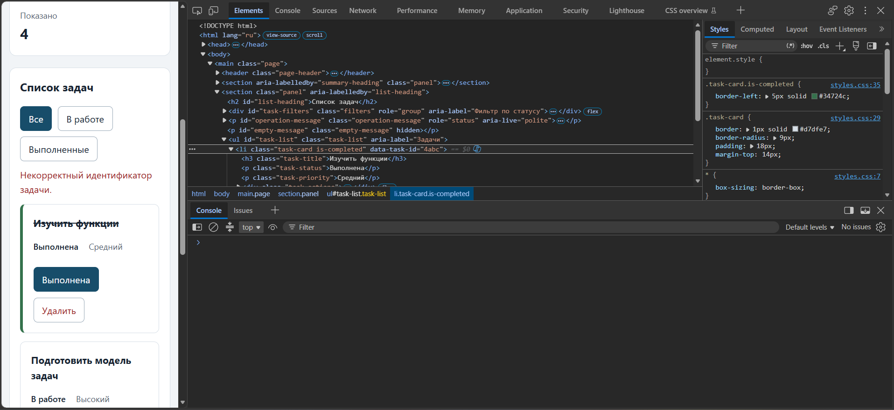
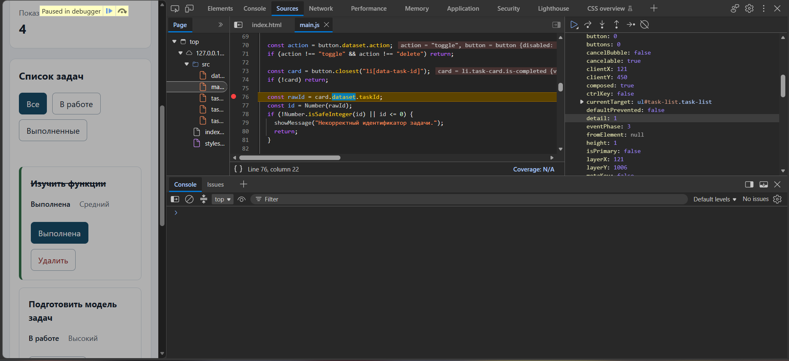

# Практическая работа № 3. Работа с DOM и событиями

## Данные работы

| Поле | Значение |
|---|---|
| Имя | Соколов Александр Юрьевич |
| Группа | ЭФБО-06-25 |
| Вариант из ПР2 | 2 |
| Node.js | v24.21.0 |
| Браузер | Microsoft Edge 154.0.4258.37 |
| Операционная система | Windows 11 |

## Запуск

Рабочая папка: `practice-03` внутри личного репозитория.

```bash
npm run check:service
npm start
```

Устанавливать зависимости через `npm install` не требуется. Для PowerShell при блокировке `npm.ps1` доступны `npm.cmd` и прямые команды `node`.

```text
http://127.0.0.1:5503/
http://127.0.0.1:5503/index.html?dataset=variant
http://127.0.0.1:5503/examples/dom-events.html
http://127.0.0.1:5503/checks.html
```

Остановка сервера: `Ctrl+C`.

## Что перенесено из ПР2

`task-service.js` и `data.js` взяты из ПР2. Результат проверки: `Проверок пройдено: 35; не пройдено: 0.`

## Эксперименты

| № | До запуска: прогноз | После запуска: результат | Объяснение |
|---:|---|---|---|
| 1. Отсутствующий элемент и коллекция | `null`, `0` | `null`, `0` | Отсутствующих элементов нет, список пустой |
| 2. dataset и числовой id | `23 string` | `23 string` | id в html разметке записывается, как строка |
| 3. Статический NodeList | `1`, `3` | `1`, `3` | Добавлено два новых элемента. Теперь `querySelectorAll` видит три записи |
| 4. Строка с HTML-разметкой | `<strong>Это текст, а не HTML</strong>` | `<strong>Это текст, а не HTML</strong>` | Содержимое заголовка изменено с помощью JS. Новый заголовок при этом не создаёься и не записывается в файл разметки страницы |
| 5. Распространение события (`phase`, `target`, `currentTarget`) | `1`, `lab-label`, `lab-card`; `3`, `lab-label`, `lab-button`; `3`, `lab-button`, `lab-card` | `1`, `lab-label`, `lab-card`; `3`, `lab-label`, `lab-button`; `3`, `lab-label`, `lab-card` | Сначало произошёл захват `span id="lab-label"`, но обработчик настроен на `section id="lab-card"`, поэтому далее происходит "всплытие": `currentTarget` сначала меняется на `button id="lab-button"`, затем на `section id="lab-card"`. После этого обработчик начинает выполняться. |

## Организация кода

Кратко описать `task-service.js`, `task-selectors.js`, `task-view.js` и `main.js`.
Указать, где хранятся полный список и фильтр, где обрабатывается событие и где вычисляется сводка.

Описание функцианала:
- `task-service.js` - Реализация функций, отвечающих за базовые действия: создать задачу, вернуть массив названий задач и так далее
- `task-selectors.js` - Содержит одну функцию-фильтр
- `task-view.js`- Манипуляция карточками задач, заполнение сводки по всему списку задач
- `main.js`- Использование функций из других JS файлов. Фильтрация.

## Общий сценарий

| Шаг | Видимые id | Всего | Выполнено | Осталось | Прогресс | Показано | Сообщение | Совпало с ожиданием |
|:--- |:---------- |:----- | :-------- | :------- | :--------| :------- | :-------- | :------------------ |
| 0. Исходный набор, "Все" | `[1, 4, 7, 10]` | 4 | 2 | 2 | `50.0%` | 4 | - | Да |
| 1. Выбрать "В работе" | `[4, 7]` | 4 | 2 | 2 | `50.0%` | 2 | - | Да |
| 2. Отметить выполненной `id = 4` | `[7]` | 4 | 3 | 1 | `75.0%` | 1 | - | Да |
| 3. Выбрать "Все" | `[1, 4, 7, 10]` | 4 | 3 | 1 | `75.0%` | 4 | - | Да |
| 4. Удалить `id = 7` | `[1, 4, 10]` | 3 | 3 | 0 | `100.0%` | 3 | - | Да |
| 5. Выбрать "В работе" | `[]` | 3 | 3 | 0 | `100.0%` | 0 | Нет задач по выбранному фильтру. | Да |
| 6. Выбрать "Все", переключить `id = 1` | `[1, 4, 10]` | 3 | 2 | 1 | `66.7%` | 3 | - | Да |
| 7. Последовательно удалить `1`, `4`, `10` | `[]` | 0 | 0 | 0 | `0.0%` | 0 | Список задач пуст. | Да |


После перезагрузки: описать наблюдение.

## Индивидуальный вариант

Тема: Подготовка выступления.
Исходные задачи:
- `{ id: 11, title: "Сформулировать тему и цель", completed: true, priority: "medium" }`,
- `{ id: 23, title: "Изучить аудиторию", completed: false, priority: "high" }`,
- `{ id: 37, title: "Составить план выступления", completed: false, priority: "high" }`,
- `{ id: 41, title: "Подготовить слайды", completed: false, priority: "high" }`,
- `{ id: 58, title: "Отрепетировать с хронометражем", completed: false, priority: "low" }`,
- `{ id: 64, title: "Проверить оборудование и место", completed: false, priority: "high" }`

| Этап                       | Всего | Выполнено | Осталось | Прогресс | Видимые id               |
|---                         |---    |---        |---       |---       |---                       |
| До действий                | 6     | 1         | 5        | 16.7%    | [11, 23, 37, 41, 58, 64] |
| После переключения 23      | 6     | 2         | 4        | 33.3%    | [11, 23, 37, 41, 58, 64] |
| После удаления 37          | 5     | 2         | 3        | 40.0%    | [11, 23, 41, 58, 64]     |
| Итог, фильтр "В работе"    | 5     | 2         | 3        | 40.0%    | [41, 58, 64]             |
| Итог, фильтр "Выполненные" | 5     | 2         | 3        | 40.0%    | [11, 23]                 |

До переключений:
- `<li class="task-card" is-completed data-task-id="11"> ... </li>`
- `<li class="task-card" data-task-id="23"> ... </li>`
- `<li class="task-card" data-task-id="37"> ... </li>`
- `<li class="task-card" data-task-id="41"> ... </li>`
- `<li class="task-card" data-task-id="58"> ... </li>`
- `<li class="task-card" data-task-id="64"> ... </li>`

После переключения 23:
- `<li class="task-card" is-completed data-task-id="11"> ... </li>`
- `<li class="task-card is-completed" data-task-id="23"> ... </li>`
- `<li class="task-card" data-task-id="37"> ... </li>`
- `<li class="task-card" data-task-id="41"> ... </li>`
- `<li class="task-card" data-task-id="58"> ... </li>`
- `<li class="task-card" data-task-id="64"> ... </li>`

После удаления 37:
- `<li class="task-card" is-completed data-task-id="11"> ... </li>`
- `<li class="task-card is-completed" data-task-id="23"> ... </li>`
- `<li class="task-card" data-task-id="41"> ... </li>`
- `<li class="task-card" data-task-id="58"> ... </li>`
- `<li class="task-card" data-task-id="64"> ... </li>`


## Протокол проверки сервиса

**реальный вывод** `npm run check:service`:

```text

Debugger attached.
OK: 01. Создание задачи с явным приоритетом
OK: 02. Приоритет по умолчанию
OK: 03. Удаление краевых пробелов без изменения внутренних
OK: 04. Граничные длины названия и положительный безопасный id
OK: 05. Некорректные названия при создании
OK: 06. Некорректные идентификаторы при создании
OK: 07. Все допустимые приоритеты и отклонение недопустимых
OK: 08. Каждый вызов createTask возвращает новый объект
OK: 09. Поиск по id, а не по индексу
OK: 10. Отсутствующая задача и пустой массив при поиске
OK: 11. Поиск не преобразует строковый id в число
OK: 12. Получение невыполненных задач
OK: 13. Пустой список, все выполнены и все не выполнены
OK: 14. Названия в исходном порядке и пустой список
OK: 15. Сводка по общему набору
OK: 16. Сводка по пустому списку
OK: 17. Сводка: ничего не выполнено и выполнено всё
OK: 18. Процент остаётся числом без предварительного округления
OK: 19. Добавление в конец без изменения входного массива
OK: 20. Добавление в пустой список с приоритетом по умолчанию
OK: 21. Повторяющийся id отклоняется
OK: 22. Добавление не обходит проверки createTask
OK: 23. Изменение completed в обе стороны
OK: 24. completed принимает только boolean
OK: 25. Некорректный или отсутствующий id при изменении статуса
OK: 26. Повторная установка статуса создаёт новый результат
OK: 27. Переименование сохраняет остальные поля
OK: 28. Проверки названия при переименовании
OK: 29. Некорректный или отсутствующий id при переименовании
OK: 30. Удаление по id с сохранением порядка
OK: 31. Удаление единственной записи
OK: 32. Некорректный, отсутствующий id и удаление из пустого списка
OK: 33. Входные объекты не изменяются ни одной операцией
OK: 34. Общий сценарий и все промежуточные сводки
OK: 35. Работа с другим набором, без зависимости от demoTasks

Проверок пройдено: 35; не пройдено: 0.
Waiting for the debugger to disconnect...
Waiting for the debugger to disconnect...
```

## Протокол браузерных проверок

**реальный текст** из блока "Текстовый протокол" на `checks.html`:

```text
OK: Фильтр all возвращает новый массив в исходном порядке
OK: Фильтр pending выбирает невыполненные задачи
OK: Фильтр completed выбирает выполненные задачи
OK: Все три фильтра работают с пустым списком
OK: Фильтрация не меняет входные записи и их порядок
OK: Карточка — li.task-card с числовым id в dataset
OK: Статус невыполненной карточки и aria-pressed согласованы
OK: Статус выполненной карточки и aria-pressed согласованы
OK: В карточке две обычные кнопки с вложенными подписями
OK: Все приоритеты отображаются по установленному словарю
OK: Название с разметкой отображается текстом
OK: Отрисовка списка создаёт карточки в исходном порядке
OK: Повторная отрисовка не накапливает карточки
OK: Контейнер списка и его обработчик сохраняются
OK: Отрисовка пустого массива очищает прежние карточки
OK: Сводка считается по всему списку, отдельно выводится Показано
OK: Пустая сводка не содержит NaN и Infinity
OK: Сообщение для полностью пустого списка
OK: Сообщение для пустого результата фильтра
OK: Появление карточек скрывает прежнее пустое состояние
OK: Приложение: начальный набор и сводка
OK: Приложение: фильтр срабатывает по клику на вложенный span
OK: Приложение: активный фильтр отмечен классом и aria-pressed
OK: Приложение: фильтрация не удаляет скрытые задачи
OK: Приложение: переключение по id, а не индексу массива
OK: Приложение: выполненная задача исчезает из фильтра В работе
OK: Приложение: удаление изменяет данные, а не только DOM
OK: Приложение: клик по названию не изменяет данные
OK: Приложение: после перерисовок одно нажатие — одно изменение
OK: Приложение: удаление всех записей и нулевая сводка
OK: Приложение: нет совпадений — не то же самое, что нет задач
OK: Приложение: неизвестный числовой id не меняет данные
OK: Приложение: id 4abc не превращается в 4
OK: Приложение: неизвестное действие игнорируется
OK: Приложение: после изменения сохраняется клавиатурный фокус
OK: Приложение: новая загрузка возвращает исходное состояние

Всего: 36. Пройдено: 36. Ошибок: 0.
```

## Собственные проверки
Исходные задания:
- `{ id: 1, title: "Изучить функции", completed: true, priority: "medium" }`,
- `{ id: 4, title: "Подготовить модель задач", completed: false, priority: "high" }`,
- `{ id: 7, title: "Проверить методы массивов", completed: false, priority: "low" }`,
- `{ id: 10, title: "Оформить README", completed: true, priority: "medium" }`

| № | Исходное состояние и действия | Ожидаемый результат | Фактический результат | Итог |
|---:|---|---|---|---|
| 1 | [Исходные данные](#L213-L218). Удалить всё, кроме `id = 4` | Всего: `1`; Выполнено: `0`; Осталось: `1`; Прогресс: `0.0%`; Показано: `1` | Совпадает с ожидаемым | После удаления осталась одна задача |
| 2 | [Исходные данные](#L213-L218). Переключимся на фильтр `"В работе"`, изменим `id = 7` и удалим `id = 4`| Всего: `3`; Выполнено: `3`; Осталось: `0`; Прогресс: `100.0%`; Показано: `0`; Сообщение: `Нет задач по выбранному фильтру.` | Совпадает с ожидаемым | При выполненных всех задачах и выборе фильтра `В работе` выводится сообщение `Нет задач по выбранному фильтру.` |
| 3 | [Исходные данные](#L213-L218). Переведём все задачи в статус `В работе` | Всего: `4`; Выполнено: `0`; Осталось: `4`; Прогресс: `0.0%`; Показано: `4` | Совпадает с ожидаемым | Сводка корректна |

## Отладка и клавиатура

Строка точки останова: [76 main.js](./src/main.js#L76). `event.target` = `span.action-label` (Нажатие было на текст, а не на кнопку), `event.currentTarget` = `ul#task-list.task-list`, `dataset.taskId` = `"1"` (Строка), `id` = `1` (Число).

Порядок обхода Tab:
- Ссылка "Общий набор"
- Ссылка "Свой вариант"
- Ссылка "Эксперименты"
- Ссылка "Проверки"
- Кнопка фильтра "Все"
- Кнопка фильтра "В работе"
- Кнопка фильтра "Выполненные"
- Кнопка "Выполнена" задачи id=1
- Кнопка "Удалить" задачи id=1
- Кнопка "Выполнена" задачи id=4
- Кнопка "Удалить" задачи id=4
- Кнопка "Выполнена" задачи id=7
- ...

`Enter` и `Space` работают исправно: как аналог левой кнопки мыши. Положение фокуса после изменения статуса остаётся неизменным, а после удаления он переходит на кнопку фильтра "Все".

Отказ при `id = 777` - `Cтрока не найдена.`
Отказ при `id = 4abc` - `Некорректный идентификатор задачи.`

## Вид приложения

Изображения в папке [`images`](./images):






## Дополнительное задание

Не выполнено

## Вывод

В ПР3 к функциям ПР2 подключён браузерный интерфейс: карточки строятся DOM-методами, клики обрабатываются делегированно, работают смена статуса, удаление, три фильтра, сводка и два вида пустого состояния. Проверки пройдены: 35/35 сервисных, 36/36 браузерных. Данные  меняются только сервисными функциями и хранятся до перезагрузки, а DOM пересоздаётся в renderApp(). Поэтому при перезагрузке страницы возвращаются данные из `data.js`.